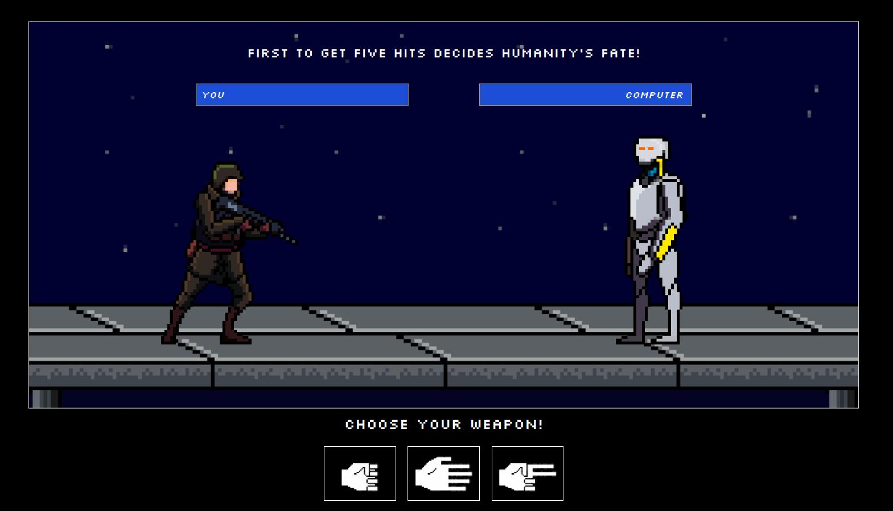

# RPS Retro Fighting Game

Welcome to the repository for my RPS Retro Fighting Game! This is a classic Rock Paper Scissors game reimagined as a retro fighting game with custom assets and sprites. It features a parody of the Terminator movies universe where humans fight machines and humanity's fate is decided by a game of Rock Paper Scissors. 

Check out the live version by clicking [here](https://vlas-dev.github.io/RPS-app/).




## 🌟 Features

- **Classic Gameplay:** Engage in the timeless Rock Paper Scissors game with a unique twist.
- **Retro Graphics:** Experience the game with custom-designed assets and sprites that pay homage to classic arcade fighting games.
- **Human vs Machine:** A parody of the Terminator movies universe where you take on the machines in a battle where the stakes are humanity's fate.
- **Accessibility:** Designed with user-friendly interfaces, suitable for all ages and skill levels.

## 🛠 Technologies Used

- HTML5
- CSS3
- JavaScript
- Tailwind CSS
- React

## 💻 Local Development

To run this project locally, follow these steps:

#### 1. Clone the Repository:
```bash
git clone git@github.com:vlas-dev/RPS-app.git
cd portfolio
```
#### 2. Install Dependencies:
```bash
npm install
```
#### 3. Start the Development Server:
```bash
npm start
```

The site should now be running at http://localhost:3000.

## 🚀 Deployment
This site is hosted using GitHub Pages.

## 🤝 Contributions
While this is a personal project, if you find any bugs or areas for improvement, please feel free to open an issue or create a pull request.

## ✉️ Contact & Support
If you have any questions, feel free to reach out to me at [musiccofabian@gmail.com](mailto:musiccofabian@gmail.com) or connect with me on [LinkedIn](https://www.linkedin.com/in/fabi%C3%A1n-musicco-a164231b4/).
